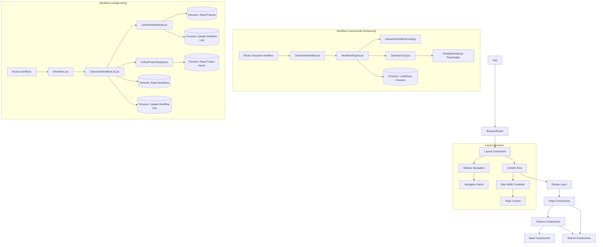
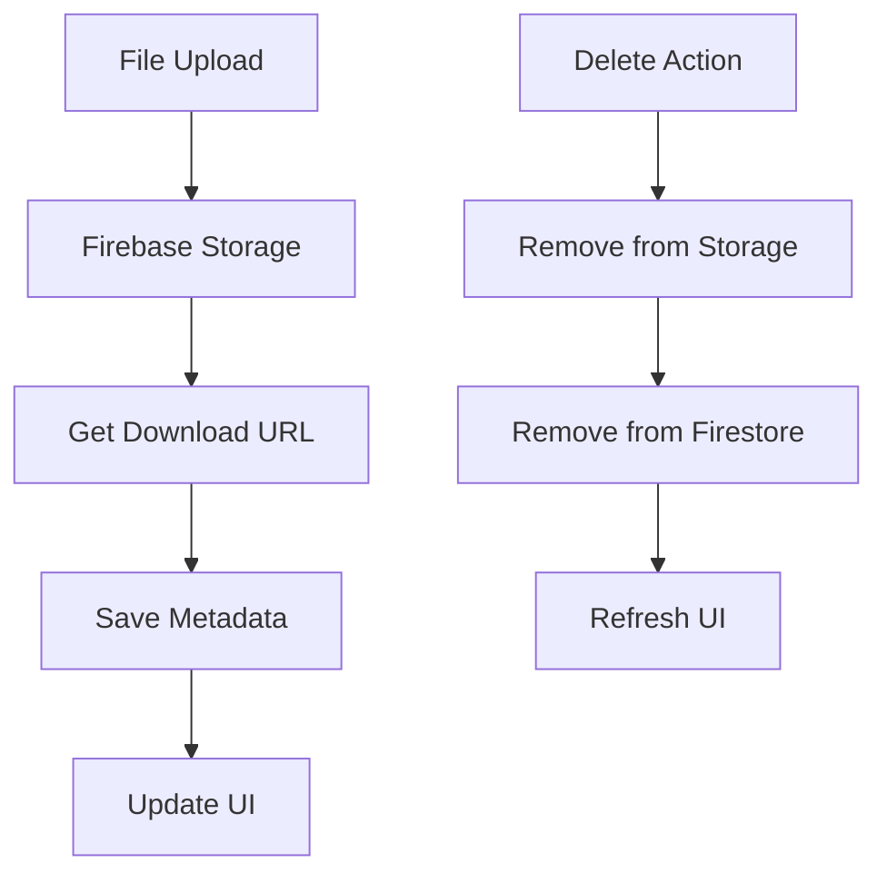
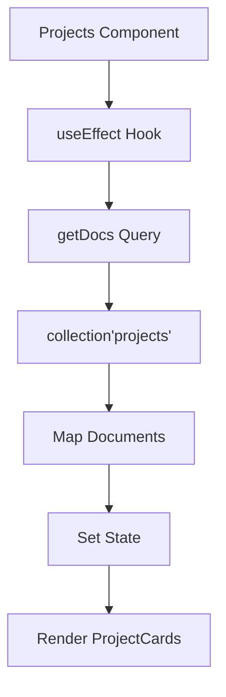
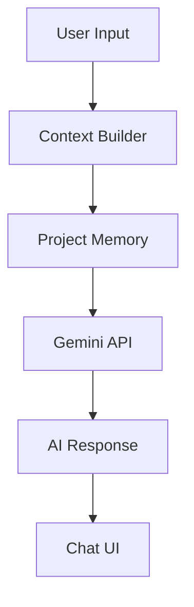

# System Patterns

## Architecture Overview

### Component Architecture


## Key Design Patterns

### 1. Route-Based Code Splitting
- Each route is a separate code bundle
- Lazy loading for optimal performance
- Routes:
  ```
  /                 # Home
  /projects         # Projects Dashboard
  /projects/:id     # Project Detail
  /settings         # User Settings
  /workflows        # Character Workflows List Page (`Workflows.jsx`)
  /character-workflow # Enhanced Character Workflow Engine (`CharacterWorkflow.jsx`, uses `?id=...`)
  ```

### 2. Component Hierarchy
- **Page Components**: Route-level components
  - Home: Landing page
  - Projects: Project dashboard with grid layout
  - ProjectDetail: Individual project view
    - Dynamic routing with useParams
    - Firestore document fetching
    - Basic content layout
  - Workflows: Character workflow dashboard (`Workflows.jsx` - displays start card & `CharacterWorkflowList.jsx`).
  - CharacterWorkflow: Top-level route component for the enhanced workflow engine (`CharacterWorkflow.jsx`). Renders `WorkflowEngine.jsx`.
- **Feature Components**: Business logic containers (ProjectCard, CharacterWorkflowList, LinkWorkflowModal, LinkedProjectDisplay).
- **Workflow Engine Components**: Specific to the enhanced character workflow (`/src/workflows/components/`)
  - `WorkflowEngine.jsx`: Core logic, state management (current step, answers), Firestore load/save (autosave), config processing, renders current step (intro or QuestionCard), renders navigation buttons.
  - `QuestionCard.jsx`: Displays question, image, textarea (consistent size); handles local input state and triggers debounced autosave via `onAnswerChange` prop. Renders AI placeholder button & modal. Handles view mode display.
  - `AIHelperModal.jsx`: Placeholder modal for AI assistance.
- **Workflow Configuration**: (`/src/workflows/configs/`)
  - `characterWorkflowConfig.js`: Defines workflow structure, questions, images, prompts, intro text.
- **UI Components**:
  - Self-contained UI components
  - Prop-based customization
  - Consistent styling patterns
- **Navigation Components**: Top-level routing (Navbar, Sidebar)
  - React Router integration
  - Responsive layouts
  - Consistent link styling
- **Base Components**: Reusable UI elements (Button, Input, SkeletonProjectCard)
- **Shared Components**: Cross-cutting concerns (ErrorBoundary, Notification)

### 3. UI Component Patterns ("Retro Space" Theme)
```mermaid
flowchart TD
    Layout[Layout Component] --> Split[grid-cols-[250px,1fr]]
    Layout --> MinH[min-h-full]
    Layout --> BgColor[bg-teal-deep]

    Sidebar[Sidebar] --> Fixed[fixed h-full]
    Sidebar --> Width[w-64]
    Sidebar --> BgColor2[bg-teal-deep]
    Sidebar --> NoBorder[No right border]
    Sidebar --> LogoHeader[Logo Image Header (links home)]
    Sidebar --> NavItems[Nav Items (no emojis, orange active state)]

    Content[Content Area] --> MaxW[max-w-6xl]
    Content --> Center[mx-auto]
    Content --> Spacing[space-y-8]
    Content --> Padding[p-8]

    Card[Card Components] --> BgColor3[bg-teal-light]
    Card --> Round[rounded-lg]
    Card --> Border[border border-cream-yellow/20]
    Card --> Padding2[p-6]

    ButtonPrimary[Primary Buttons] --> BgColor4[bg-orange-vibrant]
    ButtonPrimary --> Text[text-white]
    ButtonPrimary --> Size[px-4 py-2]
    ButtonPrimary --> Round2[rounded-md]
    ButtonPrimary --> Hover[hover:brightness-110]
    ButtonPrimary --> Trans[transition-all]

    ButtonSecondary[Secondary Buttons] --> Border2[border border-cream-yellow]
    ButtonSecondary --> Text2[text-cream-yellow]
    ButtonSecondary --> Hover2[hover:bg-cream-yellow/10]
    ButtonSecondary --> Size
    ButtonSecondary --> Round2
    ButtonSecondary --> Trans

    Grid[Grid System] --> Mobile[grid-cols-1]
    Grid --> Tablet[sm:grid-cols-2]
    Grid --> Desktop[lg:grid-cols-3]
    Grid --> Gap[gap-6]

    Form[Form Components] --> Space[space-y-4]
    Form --> Labels[text-cream-gray text-sm]
    Form --> Inputs[Input Fields]
    Inputs --> BgColor5[bg-teal-light]
    Inputs --> Border3[border border-cream-yellow/30]
    Inputs --> Text3[text-cream-yellow]
    Inputs --> Focus[focus:ring-orange-vibrant focus:border-orange-vibrant]

    Modal[Modal Dialogs] --> Overlay[bg-black/70]
    Modal --> ContentBox[bg-teal-deep rounded-lg border border-cream-yellow/20]
    Modal --> Position[fixed inset-0 flex items-center justify-center]

    Notification[Notification Component] --> Positioned[fixed bottom-4 right-4]
    Notification --> Style[bg-orange-vibrant or bg-red-600]
    Notification --> Text4[text-white]
    Notification --> Animation[fade-in/out]

    Skeleton[Skeleton Loaders] --> Animation[animate-pulse]
    Skeleton --> Style[bg-teal-light/50 rounded]

    subgraph "Workflow UI (Step-by-Step)"
        WEngine[WorkflowEngine] --> CurrentStep{Render Current Step}
        CurrentStep -- intro --> IntroText[Intro Text + Start Button]
        CurrentStep -- question --> QCard[QuestionCard]
        WEngine --> NavButtons[Renders Nav Buttons (Prev/Next/Finish)]
        QCard --> ImageDisplay[Image Display]
        QCard --> InputArea[Textarea Input]
        QCard --> AIButton[AI Helper Button]
        AIButton --> AIModal[AIHelperModal]
    end
```

### 4. Styling Strategy ("Retro Space" Theme)
- Tailwind CSS with custom theme extensions defined in `tailwind.config.js`.
- **Color Palette:**
  ```js
  theme: {
    extend: {
      colors: {
        'teal-deep': '#0f303d',      // Primary background (dark teal/green)
        'teal-light': '#1a4c5d',     // Secondary background (cards, inputs)
        'orange-vibrant': '#f58a07', // Accent color (buttons, active states)
        'cream-yellow': '#f9f4d9',   // Primary text, secondary borders/buttons
        'cream-gray': '#d1cbbd',     // Secondary text (lighter cream/gray)
      },
      // ... other extensions like fontFamily if applicable
    }
  }
  ```
- **Key Principles:**
  - Dark theme base using `teal-deep` and `teal-light`.
  - High contrast text using `cream-yellow` and `cream-gray`.
  - Vibrant `orange-vibrant` for calls to action and highlights.
  - Solid colors preferred over gradients.
  - Consistent focus states using `orange-vibrant` rings.
- **Animation System (Maintained):**
  ```js
  // (Animation definitions remain largely the same, potentially adjusted timing/easing)
  animation: {
    'float': 'float 3s ease-in-out infinite', // Subtle vertical movement
    'fade-in': 'fade-in 0.3s ease-out'      // Faster fade-in
  },
  keyframes: {
    float: { /* ... */ },
    'fade-in': { /* ... */ }
  }
  ```
- **Component Styling Examples:** (See Mermaid diagram above for class examples)
  - **Layout:** `bg-teal-deep` overall.
  - **Sidebar:** `bg-teal-deep`, no right border, logo header.
  - **Cards:** `bg-teal-light`, `border border-cream-yellow/20`.
  - **Buttons (Primary):** `bg-orange-vibrant`, `text-white`.
  - **Buttons (Secondary):** `border border-cream-yellow`, `text-cream-yellow`.
  - **Inputs:** `bg-teal-light`, `border border-cream-yellow/30`, `text-cream-yellow`, `focus:ring-orange-vibrant`.
  - **Text:** Primary `text-cream-yellow`, Secondary `text-cream-gray`.
  - **Navigation:** Active links use `orange-vibrant` accent. No emojis.

### 5. Navigation Patterns
```mermaid
flowchart TD
    subgraph "Navigation Flow"
        URL[URL Change] --> Router[React Router]
        Router --> Layout[Layout Component]
        Layout --> Split[Split View]
        Split --> Sidebar[Sidebar Nav]
        Split --> Content[Content Area]
        Content --> Route[Route Component]
    end

    subgraph "Sidebar Interaction"
        NavItem[Nav Item] --> Active[Active State]
        Active --> Highlight[Orange Accent (e.g., left border)]
        NavItem --> Hover[Hover State]
        Hover --> BgChange[Subtle Background Change (e.g., bg-teal-light/50)]
        NavItem --> NoEmoji[Text Only (No Emojis)]
    end

    subgraph "Content Transition"
        Route --> Load[Load Content]
        Load --> MaxWidth[Max Width Container]
        MaxWidth --> Sections[Content Sections]
    end
```

- Semantic HTML structure (`nav` element in Sidebar).
- Sidebar Navigation:
  - Fixed position on the left.
  - Logo image header (links home).
  - Text-only navigation links (no emojis).
  - Active state indicated by `orange-vibrant` accent.
  - Hover state uses subtle background color change.
  - No vertical right border on the sidebar itself.
- Smooth transitions for hover/active states.
- Responsive layout adaptation handled by main layout grid.
- Clear visual hierarchy.

### 6. State Management
- React Context for global state
- Local state for component-specific data
- Firebase real-time updates for project data
- Optimistic UI updates for better UX

### 7. Data Flow Patterns
```mermaid
flowchart LR
    Mount[Component Mount] --> Fetch[Fetch Projects]
    Fetch --> Query[Firestore Query]
    Query --> Map[Map Documents]
    Map --> State[Update State]
    State --> Render[Render UI]
    
    Click[Card Click] --> Navigate[useNavigate]
    Navigate --> Route[Project Route]
    Route --> Params[useParams]
    Params --> DocFetch[Fetch Doc]
    DocFetch --> DetailState[Detail State]
    DetailState --> DetailUI[Detail UI]

    subgraph "Character Workflow Engine Data Flow (Edit/Resume)"
        direction LR
        CW_Mount[WorkflowEngine Mount w/ ID] --> CW_LoadConfig[Load Config]
        CW_Mount --> CW_LoadAnswers[Fetch Answers]
        CW_LoadAnswers --> CW_Query[Firestore Query 'answers' subcollection]
        CW_Query --> CW_SetAnswers[Set 'answers' State]
        CW_SetAnswers --> CW_CalcStart[Calculate Start Step Index]
        CW_CalcStart --> CW_SetStep[Set 'currentStepIndex' State]
        CW_SetStep --> CW_RenderStep[Render Intro/QuestionCard]

        CW_RenderStep -- Renders --> QC[QuestionCard]
        QC --> UserInput[User Types]
        UserInput --> QC_SetLocal[Set Local Input State]
        QC_SetLocal --> QC_Debounce[Debounce Timer]
        QC_Debounce --> QC_CallHandler[Call onAnswerChange(id, value)]
        QC_CallHandler --> CW_HandleChange[WorkflowEngine handleAnswerChange]
        CW_HandleChange --> CW_SetAnswers
        CW_HandleChange --> CW_SaveAnswer[WorkflowEngine saveAnswer]
        CW_SaveAnswer --> CW_SetDoc[Firestore setDoc 'answers/{qid}']
        CW_SaveAnswer -- If id=='name' --> CW_UpdateName[Firestore updateDoc 'workflow/{id}']

        UserNav[User Clicks Next/Prev] --> CW_NavHandler[WorkflowEngine handleNext/handlePrevious]
        CW_NavHandler --> CW_SetStep
    end
```

## Firebase Integration

### 1. Data Structure
```
projects/
  ├─ {projectId}/
  │  ├─ title: string
  │  ├─ description: string
  │  ├─ createdAt: timestamp
  │  ├─ updatedAt: timestamp
  │  ├─ characters/
  │  │  └─ {characterId}/
  │  ├─ notes/
  │  │  └─ {noteId}/
  │  └─ files/
  │     └─ {fileId}/
  │        ├─ name: string
  │        ├─ url: string
  │        ├─ type: string
  │        └─ createdAt: timestamp

characterWorkflows/
  ├─ {workflowId}/               <-- Document for overall workflow state
  │  ├─ name: string             <-- Updated when 'name' question answered
  │  ├─ createdAt: timestamp
  │  ├─ completed: boolean        <-- Set to true on Finish
  │  ├─ completedAt?: timestamp   <-- Optional timestamp for completion
  │  ├─ linkedProjectId?: string  <-- Optional: ID of the linked project
  │  └─ answers/                  <-- Subcollection for individual answers
  │     └─ {questionId}/          <-- Document ID = question ID from config
  │        ├─ value: string        <-- The actual answer text
  │        └─ lastUpdated: timestamp

userPreferences/
  ├─ {userId}/
  │  ├─ theme: string
  │  └─ ... (other preferences)
```

### 2. File Management Patterns


### 3. Storage Organization
```
Firebase Storage/
  └─ projects/
      └─ {projectId}/
          └─ files/
              └─ {filename}
```

### 4. Data Fetching Patterns


### 5. Component Data Flow
```mermaid
flowchart LR
    Firestore[Firestore] --> Projects[Projects.jsx]
    Projects --> ProjectCard[ProjectCard.jsx]
    ProjectCard --> UI[UI Render]

### 5b. Workflow Linking Data Flow
```mermaid
flowchart TD
    subgraph "Link Workflow"
        A[User Clicks 'Link Project' in List] --> B{Open LinkWorkflowModal}
        B --> C[Fetch Projects List]
        C --> D[Firestore Query 'projects']
        D --> E[Display Projects in Modal]
        F[User Selects Project] --> G[Update Workflow Document]
        G --> H[updateDoc 'characterWorkflows/{workflowId}']
        H --> I[Set 'linkedProjectId' field]
        I --> J[Show Success Notification via Callback]
        J --> K[Close Modal & Update List UI]
        E --> F
    end

    subgraph "Unlink Workflow"
        L[User Clicks 'Unlink Project' in List] --> M[Confirm Action]
        M --> N[Update Workflow Document]
        N --> O[updateDoc 'characterWorkflows/{workflowId}']
        O --> P[Remove 'linkedProjectId' field using deleteField()]
        P --> Q[Show Success Notification]
        Q --> R[Update List UI]
    end
```

### 6. Security Rules
- User-based access control
- Project-level permissions
- File type restrictions
- Rate limiting for AI interactions

## AI Integration Architecture

### 1. Chat System


### 2. Memory Management
- Project-specific context storage
- Conversation history retention
- Metadata indexing for context retrieval
- Automatic memory pruning

## Error Handling
- Global error boundary
- Firebase operation retries (consider adding for saves)
- Graceful AI fallbacks (when implemented)
- User feedback mechanisms (Custom `Notification.jsx` component for link/unlink/save status)
- Route-level error handling (e.g., missing workflow ID)

## Performance Patterns
- Route-based code splitting
- Asset optimization
- Firebase query optimization
- Memory usage monitoring
- AI response caching
- Route prefetching
- Component-level code splitting
- Skeleton loaders for perceived performance during data fetching (workflow list, link modal, workflow engine initial load).

## Testing Strategy
- Component unit tests
- Integration tests for Firebase
- AI interaction tests
- End-to-end user flows
- Route navigation tests
- UI component testing
- Responsive design testing

### 8. Authentication Patterns
- **AuthContext**: Provides global user state, loading, error, and authentication actions (login, signup, Google sign-in, logout) via React Context. Used throughout the app for authentication-aware logic.
- **ProtectedRoute**: Higher-order component that checks authentication state and redirects unauthenticated users to `/login`. Wraps all private routes (projects, settings, workflows, etc.).
- **Sidebar Auth-Aware UI**: Sidebar navigation displays "Sign In" and "Sign Up" when logged out, and user info with "Logout" when logged in. Uses AuthContext for state.
- **Login/Signup Pages**: `/login` and `/signup` routes provide forms for Email/Password and Google authentication, with error handling and loading states.
- **Multi-User Data Isolation (Planned)**: Next step is to add userId to all Firestore documents and update queries/security rules for per-user data access.

## Updates
2025-04-15: Updated component architecture, routes, component hierarchy, Firestore data structure, and data flow diagrams to reflect the enhanced, config-driven, step-by-step Character Workflow system (`WorkflowEngine`, `QuestionCard`, etc.) and the workflow linking features. Removed `WorkflowSection`. Added details on View Mode, autosave, resume logic, and placeholder AI modal.
2025-04-15: Updated UI Component Patterns (Mermaid diagram), Styling Strategy, and Navigation Patterns sections to reflect the new "Retro Space" theme (deep teal, vibrant orange, cream/yellow). Replaced previous color system details and updated component styling examples. Documented sidebar changes (logo header, no emojis, no border).
