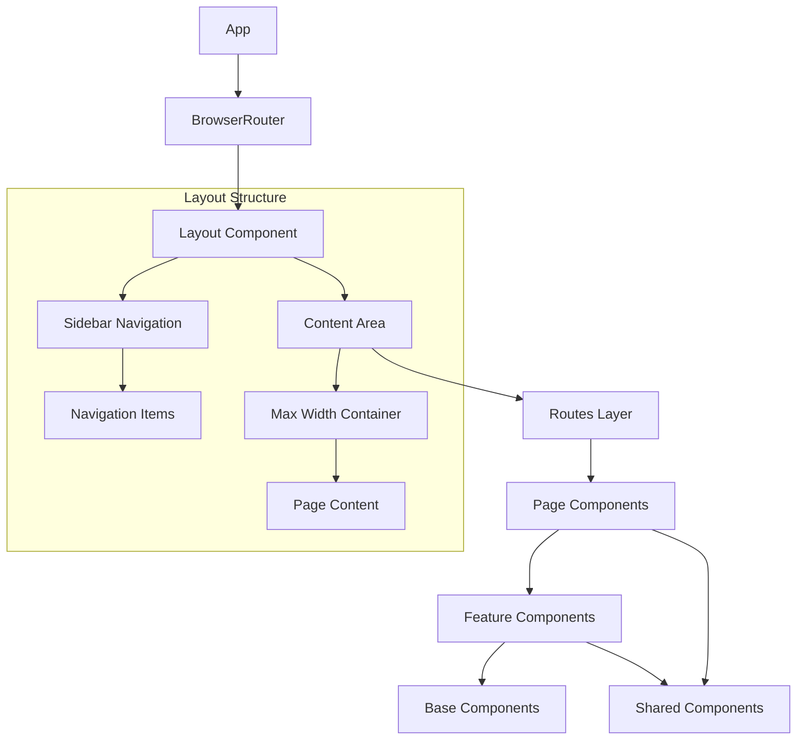
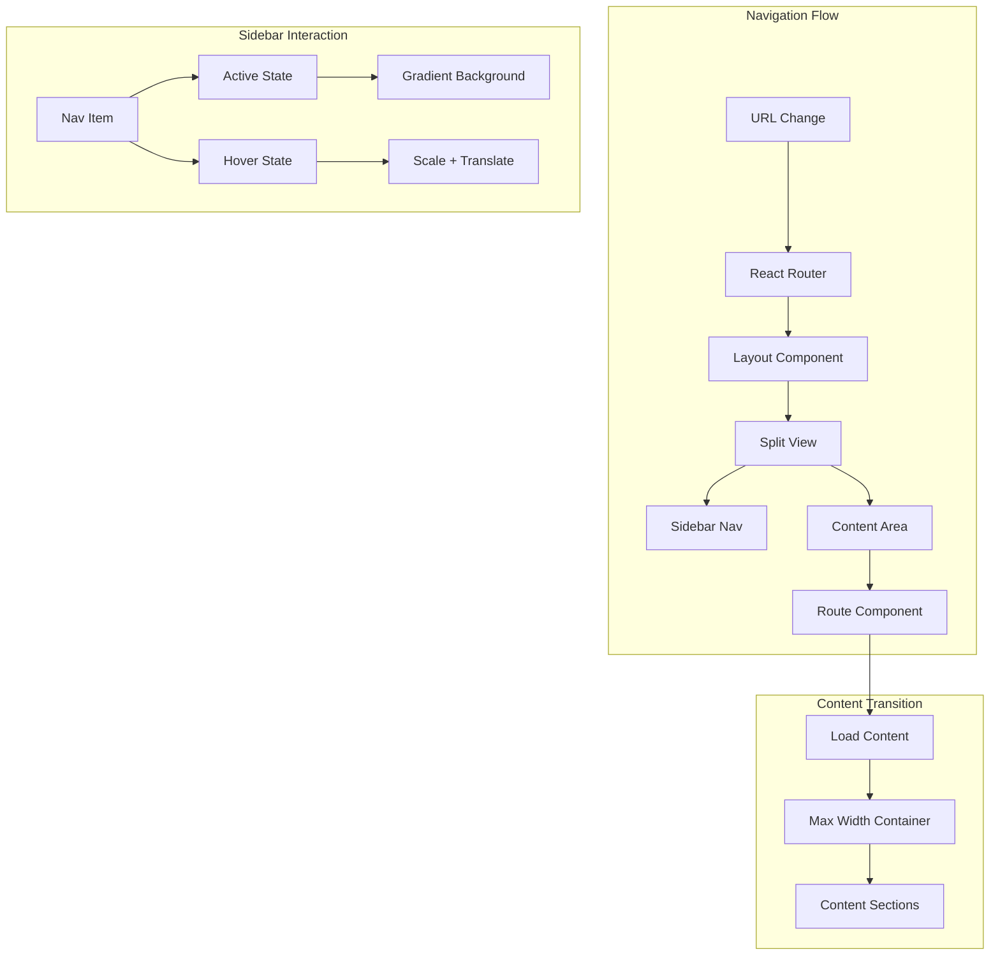
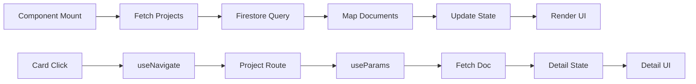
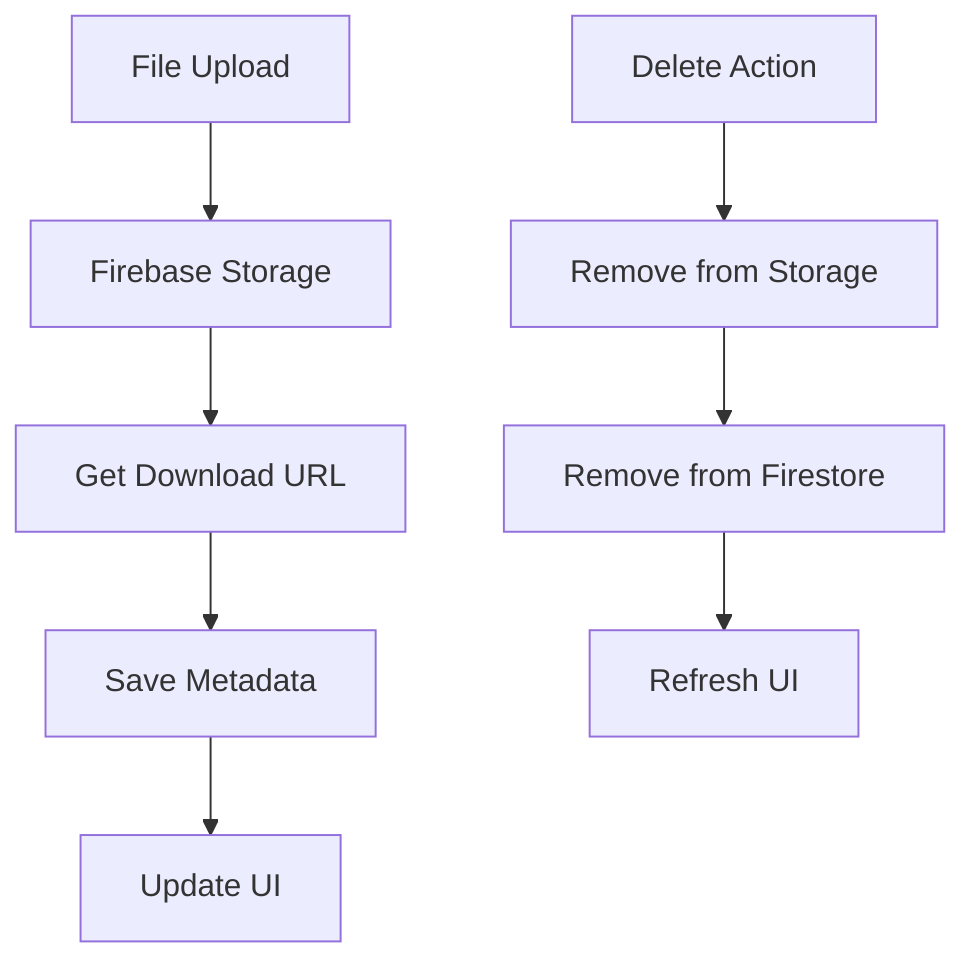
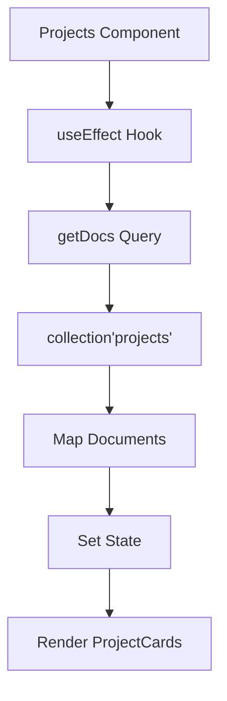
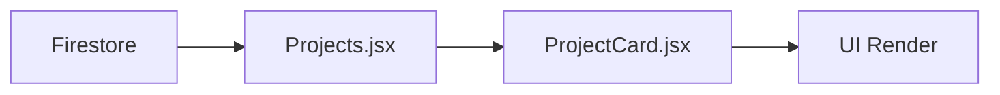
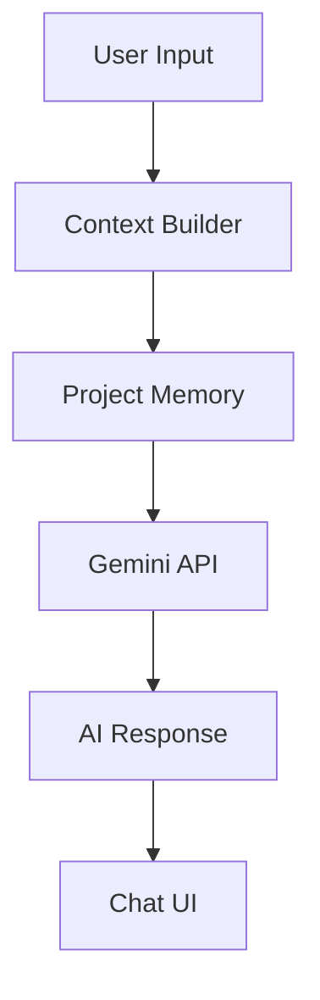

# System Patterns

## Architecture Overview

### Component Architecture


## Key Design Patterns

### 1. Route-Based Code Splitting
- Each route is a separate code bundle
- Lazy loading for optimal performance
- Routes:
  ```
  /                 # Home
  /projects         # Projects Dashboard
  /projects/:id     # Project Detail
  /settings         # User Settings
  ```

### 2. Component Hierarchy
- **Page Components**: Route-level components
  - Home: Landing page
  - Projects: Project dashboard with grid layout
  - ProjectDetail: Individual project view
    - Dynamic routing with useParams
    - Firestore document fetching
    - Basic content layout
- **Feature Components**: Business logic containers (ProjectCard)
  - Self-contained UI components
  - Prop-based customization
  - Consistent styling patterns
- **Navigation Components**: Top-level routing (Navbar)
  - React Router integration
  - Responsive layouts
  - Consistent link styling
- **Base Components**: Reusable UI elements (Button, Input)
- **Shared Components**: Cross-cutting concerns (ErrorBoundary)

### 3. UI Component Patterns
```mermaid
flowchart TD
    Layout[Layout Component] --> Split[grid-cols-[250px,1fr]]
    Layout --> MinH[min-h-full]
    Layout --> BgGradient[bg-gradient-to-br]

    Sidebar[Sidebar] --> Fixed[fixed h-full]
    Sidebar --> Width[w-64]
    Sidebar --> Gradient[bg-gradient-to-b]
    Sidebar --> Blur[backdrop-blur-sm]

    Content[Content Area] --> MaxW[max-w-6xl]
    Content --> Center[mx-auto]
    Content --> Spacing[space-y-8]
    Content --> Padding[p-8]

    Card[Card Components] --> Shadow[shadow-creative]
    Card --> Round[rounded-xl]
    Card --> Padding2[p-6]
    Card --> BG[bg-white/80]
    Card --> Blur2[backdrop-blur-sm]

    Button[Buttons] --> Gradient2[bg-gradient-to-r]
    Button --> Colors[from-creative-purple-500 to-creative-blue-500]
    Button --> Text[text-white]
    Button --> Size[px-6 py-3]
    Button --> Round2[rounded-lg]
    Button --> Hover[hover:scale-[1.02]]
    Button --> Trans[transition-all]

    Grid[Grid System] --> Mobile[grid-cols-1]
    Grid --> Tablet[sm:grid-cols-2]
    Grid --> Desktop[lg:grid-cols-3]
    Grid --> Gap[gap-8]

    Form[Form Components] --> Space[space-y-6]
    Form --> Labels[text-sm font-bold]
    Form --> Inputs[input-creative]
    Form --> Focus[focus states]
```

### 4. Styling Strategy
- Extended Tailwind system with custom utilities
- Creative color system:
  ```js
  colors: {
    'creative-purple': {
      50: '#f5f3ff',  // Lightest purple
      100: '#ede9fe',
      200: '#ddd6fe',
      300: '#c4b5fd',
      400: '#a78bfa',
      500: '#8b5cf6',
      600: '#7c3aed',
      700: '#6d28d9',
      800: '#5b21b6',
      900: '#4c1d95'  // Darkest purple
    },
    'creative-blue': {
      50: '#eff6ff',  // Lightest blue
      100: '#dbeafe',
      200: '#bfdbfe',
      300: '#93c5fd',
      400: '#60a5fa',
      500: '#3b82f6',
      600: '#2563eb',
      700: '#1d4ed8',
      800: '#1e40af',
      900: '#1e3a8a'  // Darkest blue
    }
  }
  ```
- Animation system:
  ```js
  animation: {
    'float': 'float 3s ease-in-out infinite',
    'fade-in': 'fade-in 0.5s ease-out'
  },
  keyframes: {
    float: {
      '0%, 100%': { transform: 'translateY(0)' },
      '50%': { transform: 'translateY(-10px)' }
    },
    'fade-in': {
      '0%': { opacity: '0', transform: 'translateY(10px)' },
      '100%': { opacity: '1', transform: 'translateY(0)' }
    }
  }
  ```
- Component patterns:
  - Cards: `card-creative` with backdrop blur and gradient borders
  - Buttons: `btn-creative` with gradient backgrounds and hover transforms
  - Inputs: `input-creative` with enhanced focus states
  - Tags: `tag-creative` with gradient backgrounds
  - Text: `text-gradient` for gradient text effects

### 5. Navigation Patterns


- Semantic HTML structure (nav element)
- Gradient backgrounds with hover transforms
- Smooth transitions and animations
- Responsive layout adaptation
- Clear visual hierarchy

### 6. State Management
- React Context for global state
- Local state for component-specific data
- Firebase real-time updates for project data
- Optimistic UI updates for better UX

### 7. Data Flow Patterns


## Firebase Integration

### 1. Data Structure
```
projects/
  ├─ {projectId}/
  │  ├─ title: string
  │  ├─ description: string
  │  ├─ createdAt: timestamp
  │  ├─ updatedAt: timestamp
  │  ├─ characters/
  │  │  └─ {characterId}/
  │  ├─ notes/
  │  │  └─ {noteId}/
  │  └─ files/
  │     └─ {fileId}/
  │        ├─ name: string
  │        ├─ url: string
  │        ├─ type: string
  │        └─ createdAt: timestamp
```

### 2. File Management Patterns


### 3. Storage Organization
```
Firebase Storage/
  └─ projects/
      └─ {projectId}/
          └─ files/
              └─ {filename}
```

### 4. Data Fetching Patterns


### 5. Component Data Flow


### 6. Security Rules
- User-based access control
- Project-level permissions
- File type restrictions
- Rate limiting for AI interactions

## AI Integration Architecture

### 1. Chat System


### 2. Memory Management
- Project-specific context storage
- Conversation history retention
- Metadata indexing for context retrieval
- Automatic memory pruning

## Error Handling
- Global error boundary
- Firebase operation retries
- Graceful AI fallbacks
- User feedback mechanisms
- Route-level error handling

## Performance Patterns
- Route-based code splitting
- Asset optimization
- Firebase query optimization
- Memory usage monitoring
- AI response caching
- Route prefetching
- Component-level code splitting

## Testing Strategy
- Component unit tests
- Integration tests for Firebase
- AI interaction tests
- End-to-end user flows
- Route navigation tests
- UI component testing
- Responsive design testing
